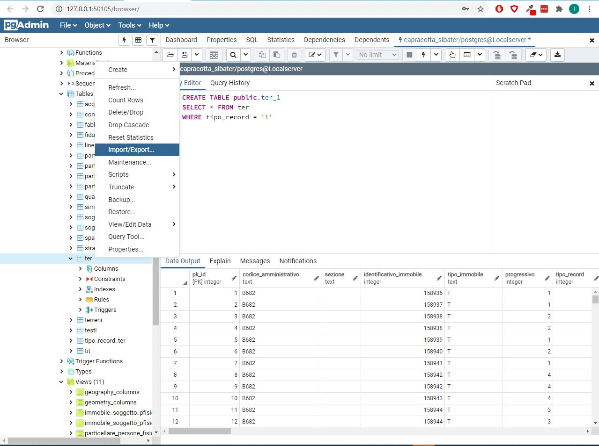

# Import-dati-censuari-in-PostgreSQL/PostGIS

<h4>Breve descrizione dei dati catastali censuari</h4>
Le informazioni descritte in questa sezione derivano dal documento a cura dell'Agenzia dell'Entrate (DOC. ES-23-IS-05) liberamente consultabile all'indirizzo https://wwwt.agenziaentrate.gov.it/mt/ServiziComuniIstituzioni/ES-23-IS-05_100909.pdf.


Per maggiori dettagli si può consultare https://www.agenziaentrate.gov.it/portale/web/guest/schede/fabbricatiterreni/portale-per-i-comuni/servizi-portale-dei-comuni/estrazione-dati-catastali.


I dati censuari sono costituiti da 4 tipi di file:
*file fabbricati (.FAB);
*file terreni (.TER);
*file soggetti (.SOG);
*file titolarità (.TIT).


Ogni tipo di file è costituito da una tabella che può contenere diversi tipi di record. Il collegamento tra i tipi di file è assicurato dalla presenta di chiavi specifiche:
*.FAB/.TER contengono la chiave identificativo immobile;
*.SOG contiene la chiave identificativo soggetto;
*.TIT contiene sia la chiave identificativo immobile che la chiave identificativo soggetto;


<h4> Importazione dei singoli file in PostgreSQL/PostGIS - .TER</h4>
Il file è costituito da 4 differenti tipi record. La particella è identificata attraverso il campo IDENTIFICATIVO IMMOBILE. La presenza di diversi tipi di record può creare delle righe duplicate per ogni particella.

*TIPO RECORD 1: contiene le caratteristiche della particella. E' il record di interesse che verrà utilizzato per ricostruire il dato spaziale;
*TIPO RECORD 2: deduzioni della particella;
*TIPO RECORD 3: riserva della particella;
*TIPO RECORD 4: porzioni della particella.

<b>Step per l'importazione del file .TER</b>

1) Creazione della tabella contenente tutti i campi (Per non crare problemi durante l'importazione è stato scelto di importare alcuni campi numerici come testi);<br>

```sql
CREATE TABLE public.ter(
  pk_id INTEGER PRIMARY KEY GENERATED BY DEFAULT AS IDENTITY,
  codice_amministrativo TEXT,
  sezione TEXT,
  identificativo_immobile INTEGER NOT NULL,
  tipo_immobile TEXT,
  progressivo INTEGER,
  tipo_record INTEGER,
  foglio TEXT,
  numero TEXT,
  denominatore INTEGER,
  subalterno TEXT,
  edificialita TEXT,
  qualita TEXT,
  classe TEXT,
  ettari INTEGER,
  are INTEGER,
  centiare INTEGER,
  flag_reddito TEXT,
  flag_porzione TEXT,
  flag_deduzioni TEXT,
  reddito_dominicale_lire INTEGER,
  reddito_agrario_lire INTEGER,
  reddito_dominicale_euro REAL,
  reddito_agrario_euro REAL,
  data_efficacia_valore_atto TEXT,
  data_registrazione_atti_valore_atto TEXT,
  tipo_nota_valore_atto TEXT,
  numero_nota_valore_atto TEXT,
  progressivo_nota_valore_atto TEXT,
  anno_nota_valore_atto TEXT,
  data_efficacia_registrazione_atto TEXT,
  data_registrazione_registrazione_atto TEXT,
  tipo_nota_registrazione_atto TEXT,
  numero_nota_registrazione_atto TEXT,
  progressivo_nota_registrazione_atto TEXT,
  anno_nota_registrazione_atto TEXT,
  partita TEXT,
  annotazione TEXT,
  identificativo_mutazione_iniziale TEXT,
  identificativo_mutazione_finale TEXT
)
```

2) Importazione dei dati. Convertire il file .TER in .csv utilizzando (si può utilizzare excel, calc, ecc.). Utilizzare la funzione di PgAdmin





3) Selezione del TIPO RECORD 1


```sql
CREATE TABLE public.ter_1(
  SELECT * FROM ter
  WHERE tipo_record = '1'
)
```


